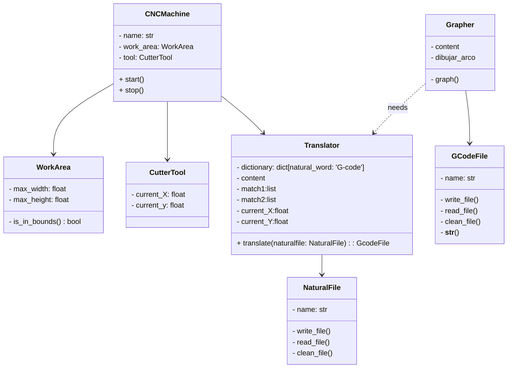
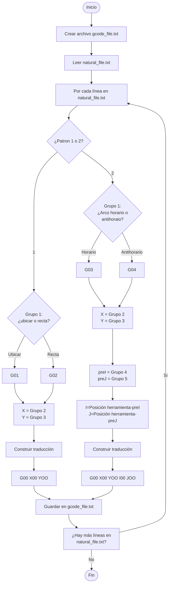

# Simulador de CNC 2D
### The Powerpuff Coders


### Integrantes:  
- Andrea Alejandra Suárez Cuervo  
- Katherine Restrepo Rodríguez  
- Zaida Alejandra Guzmán Martínez  

### Contextualización
Para comprender a cabalidad el proyecto es necesario conocer de antemano que es y para que se usa el CNC y el G-code.

El CNC (Control Numérico por Computadora) es un sistema que permite controlar con precisión la posición y el movimiento de elementos físicos mediante instrucciones codificadas. Este sistema se utiliza principalmente en procesos de mecanizado, como para controlar tornos CNC, fresadoras CNC o cortadoras láser, con el fin de fabricar piezas de manera eficiente y personalizada.

Para que la máquina entienda qué acción debe ejecutar, se utiliza un lenguaje de programación llamado G-Code. Este lenguaje está compuesto por una serie de instrucciones estructuradas, está compuesto por comandos G (de movimiento) y comandos M (de funciones auxiliares). Estas acciones pueden incluir desplazamientos, cortes, perforaciones, entre otros.
Cada línea de G-Code representa una orden específica y el conjunto de estas en un programa permite que la máquina realice el proceso completo de fabricación de una pieza. 

## Diseño e implementación
### Planteamiento del problema
Al hacer uso del CNC (Control Numérico por Computadora), la generación manual de G-code resulta ser uno de los mayores retos, ya que estos códigos suelen ser muy largos y por tanto el operario es muy propenso a equivocarse elaborandolos y un solo error de escritura o en las coordenadas puede llevar a que se dañe la lamina de trabajo o se haga una figura distinta a la deseasa, desperdiciando material y tiempo.
Por esto, se coinsidera necesario contar con una herramienta como el Simulador de CNC 2D, que  permite que una persona que no sepa G-code escriba las instrucciones en lenguaje natural y estas sean posteriormente traducidas, ademas de permitir previsualizar gráficamente cómo quedará la lámina.
### Solución implementada
Con el fin de suplir esta necesidad se desarroló un simulador que permite al usuario ingresar los comandos en lenguaje natural, traducirlos al presionar u botón mostrando el G-code resultante y graficar el recorrido de la herramienta. Este simulador tiene un sistema de validacion inicial del tamaño de la lamina, asegurando que sean medidas validas y que estas no superen el tamaño del area de trabajo definida (300x200mm). Permitiendo al usuario verificar si las instrucciones son viables y como se comportaria la herramienta.
### ¿Cómo se abordo el problema?
Toda la implementacion se estructuro mediante la programación orientada a objetos, divididnedo el sistema en modulos independientes pero integrados entre si. Se crea una clase `Translator` que identifica patrones en el texto como “Ubicar”, “Recta” o “Arco horario/antihorario” y los convierte en instrucciones en G-code, estas son utilizadas por la clase `Grapher` la cual identifica patrones en el G-code para luego graficarlos utilizando mathplotlib, permitiendo al usuario validar cada instrucción antes de su ejecución física.

## ¿Qué hace el proyecto?


### G-code a lenguaje natural
| **Comando** | **Ejemplo** | **Significado** | **Palabra natural** | **Ejemplo** |
| --- | --- | --- | --- | --- |
| G00 | `G00 X5 Y12` | Posicionamiento rápido: Ubicar herramienta, sin corte. | Ubicar | Ubicar en: 5, 12 |
| G01 | `G01 X6 Y8 Z-1`   | Interpolación lineal: Corte de material en línea recta. | Línea recta | Línea recta: 6, 8 |
| G02 | `G02 X10 Y7 I0 J-5` | Interpolación circular en sentido horario (Corte). | Arco horario, centro | Arco horario: 10, 7; Centro: 0, -5  |
| G03 | `G02 X4 Y9 I-10 J3` | Interpolación circular en sentido antihorario (Corte). | Arco antihorario, centro | Arco antihorario: 4, 9; Centro: 0, -5  |  

Para G02, G03 las coordenadas I(eje x) y J(eje y) indican la posición del centro de la interpolación circular, estas son relativas al punto en el que se encuentre la herramienta de corte que se comporta como un nuevo (0, 0). Como el programa pretende facilitar la experiencia de usuario I, J se recibirán con respecto al origen así como todas las demás coordenadas.

### Interfaz gráfica de usuario (GUI)
Decidimos utilizar Flet, una biblioteca moderna basada en Flutter que permite construir interfaces web, de escritorio y móviles con Python de manera sencilla y visualmente atractiva. 


Para representar las trayectorias, se utilizó Matplotlib, haciendo uso del backend "Agg" para renderizar los gráficos directamente como imágenes que luego son mostradas en la interfaz Flet mediante componentes de imagen codificada en base64.

- **Interpolación lineal:**  G00 `ax.plot([tool.current_X, x], [tool.current_y, y], 'k--')`   G01 `ax.plot([tool.current_X, x], [tool.current_y, y], 'b-') `
Los argumentos x, y en G-code son la coordenada de posición final.  
- **Interpolación circular:** `self._dibujar_arco(ax, x, y, I, J, sentido="antihorario" o "antihorario", puntos=puntos)`  
G-code X e Y darian el punto final del arco e I y J se utilizarian para calcular el centro. Para luego calcular los angulos inicial y final y generar puntos entre estos dos angulos como se muestra en la siguiente funcion:
```python
import re
import matplotlib.pyplot as plt
import numpy as np
import math

def _dibujar_arco(self, ax, x, y, I, J, sentido, puntos):
        cx = tool.current_X + I
        cy = tool.current_y + J
        r = np.sqrt(I**2 + J**2)

        start_ang = np.arctan2(tool.current_y - cy, tool.current_X - cx)
        end_ang = np.arctan2(y - cy, x - cx)

        if sentido == "horario":
            if end_ang > start_ang:
                end_ang -= 2 * np.pi
        else:  # antihorario
            if end_ang < start_ang:
                end_ang += 2 * np.pi

        theta = np.linspace(start_ang, end_ang, 100)
        x_arc = cx + r * np.cos(theta)
        y_arc = cy + r * np.sin(theta)

        ax.plot(x_arc, y_arc, 'r-')
        tool.current_X, tool.current_y = x, y
        puntos.append((x, y))
```
  
## Diagrama de Clases


## Diagrama de flujo `Translator`

