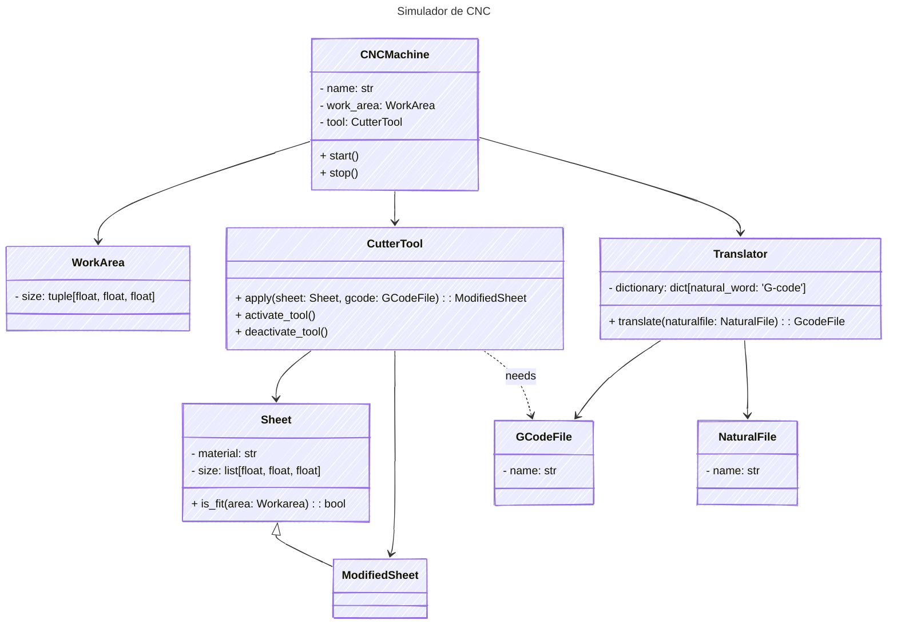

# Simulador de CNC 2D
### The Powerpuff Coders


### Integrantes:  
- Andrea Alejandra Suárez Cuervo  
- Katherine Restrepo Rodríguez  
- Zaida Alejandra Guzmán Martínez  

### Contextualización
Para comprender a cabalidad el proyecto es necesario conocer de antemano que es y para que se usa el CNC y el G-CODE.

El CNC (Control Numérico por Computadora) es un sistema que permite controlar con precisión la posición y el movimiento de elementos físicos mediante instrucciones codificadas. Este sistema se utiliza principalmente en procesos de mecanizado, como para controlar tornos CNC, fresadoras CNC o cortadoras láser, con el fin de fabricar piezas de manera eficiente y personalizada.

Para que la máquina entienda qué acción debe ejecutar, se utiliza un lenguaje de programación llamado G-Code. Este lenguaje está compuesto por una serie de instrucciones estructuradas, está compuesto por comandos G (de movimiento) y comandos M (de funciones auxiliares). Estas acciones pueden incluir desplazamientos, cortes, perforaciones, entre otros.
Cada línea de G-Code representa una orden específica y el conjunto de estas en un programa permite que la máquina realice el proceso completo de fabricación de una pieza. 

## ¿Qué hace el proyecto?


### G-code a lenguaje natural
| **Comando** | **Ejemplo** | **Significado** | **Palabra natural** | **Ejemplo** |
| --- | --- | --- | --- | --- |
| G00 | `G00 X5 Y12` | Posicionamiento rápido: Ubicar herramienta, sin corte. | Ubicar | Ubicar en: 5, 12 |
| G01 | `G01 X6 Y8 Z-1`   | Interpolación lineal: Corte de material en línea recta. | Línea recta | Línea recta: 6, 8 |
| G02 | `G02 X10 Y7 I0 J-5` | Interpolación circular en sentido horario (Corte). | Arco horario, centro | Arco horario: 10, 7; Centro: 0, -5  |
| G03 | `G02 X4 Y9 I-10 J3` | Interpolación circular en sentido antihorario (Corte). | Arco antihorario, centro | Arco antihorario: 4, 9; Centro: 0, -5  |  

Para G02, G03 las coordenadas I(eje x) y J(eje y) indican la posición del centro de la interpolación circular, estas son relativas al punto en el que se encuentre la herramienta de corte que se comporta como un nuevo (0, 0). Como el programa pretende facilitar la experiencia de usuario I, J se recibirán con respecto al origen así como todas las demás coordenadas.

### Interfaz gráfica de usuario (GUI)
Decidimos utilizar la biblioteca estandar de interfaces graficas de pyhton, Tkinter, para relizar la interfaz grafica del simulador.  


- **Interpolación lineal:** `canvas.create_line(x1, y1, x2, y2, fill="color")`  
El tercer y cuarto argumento x2, y2 en G-code corresponden a X, Y respectivamente ya que son la coordenada de posición final.  
- **Interpolación circular:** `canvas.create_arc(x0, y0, x1, y1,start=n,extent=n,style=tk.ARC)`  
Los primeros cuatro argumentos x0, y0, x1, y1 representan las esquinas opuestas del rectangulo que delimita la elipse o circulo de donde se extrae el arco, en G-code X e Y darian el punto final del arco e I y J se utilizarian para calcular el centro. Como se muestra en la siguiente funcion:
```python
import re
import matplotlib.pyplot as plt
import numpy as np
import math

def _dibujar_arco(self, ax, x, y, I, J, sentido, puntos):
        cx = tool.current_X + I
        cy = tool.current_y + J
        r = np.sqrt(I**2 + J**2)

        start_ang = np.arctan2(tool.current_y - cy, tool.current_X - cx)
        end_ang = np.arctan2(y - cy, x - cx)

        if sentido == "horario":
            if end_ang > start_ang:
                end_ang -= 2 * np.pi
        else:  # antihorario
            if end_ang < start_ang:
                end_ang += 2 * np.pi

        theta = np.linspace(start_ang, end_ang, 100)
        x_arc = cx + r * np.cos(theta)
        y_arc = cy + r * np.sin(theta)

        ax.plot(x_arc, y_arc, 'r-')
        tool.current_X, tool.current_y = x, y
        puntos.append((x, y))
```
  
## Diagrama de Clases


